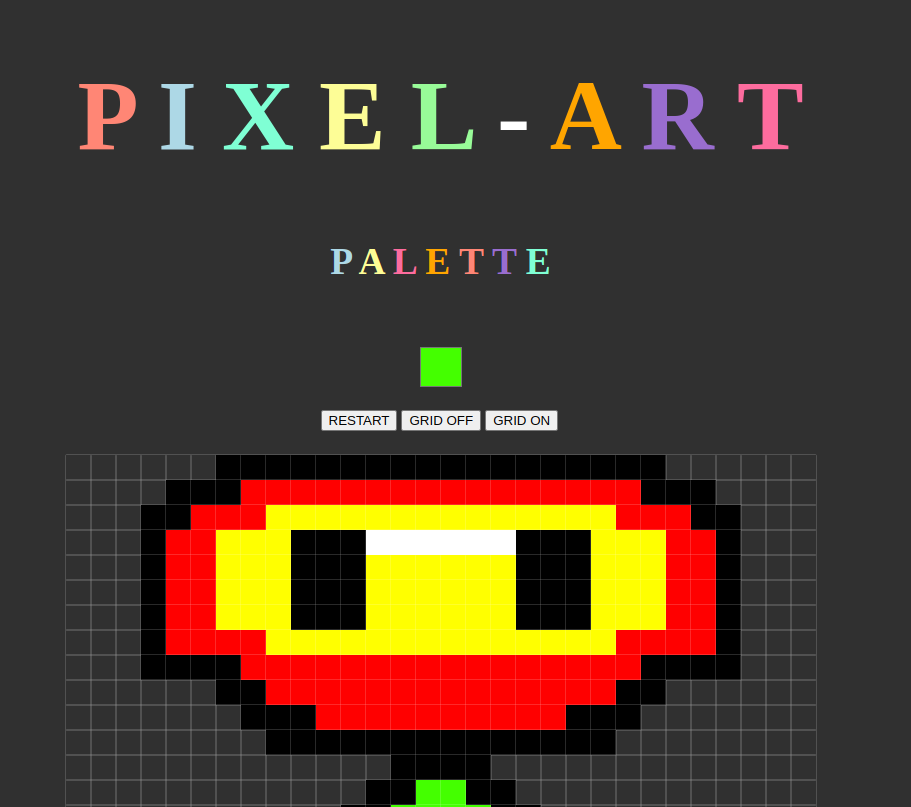

# Pixel-Art
Ce dépôt contient un projet de Pixel Art que j'ai développé. Le Pixel Art est une forme d'art numérique où les images sont créées en plaçant des pixels individuels pour former des motifs et des dessins.

Fonctionnalités principales :

  - Création de dessins Pixel Art en manipulant des pixels individuels.
  - Palette de couleurs pour sélectionner les couleurs à utiliser.
    
Technologies utilisées :

  - JavaScript pour la logique de manipulation des pixels.
  - HTML pour la structure de la page web.
  - CSS pour la mise en forme et le style de l'interface utilisateur.

Des futurs changements et mises à jour sont prévus pour améliorer le projet, notamment l'ajout de nouvelles fonctionnalités, des améliorations de l'interface utilisateur et des optimisations de performance. N'hésitez pas à suivre ce dépôt pour être informé des prochaines évolutions !

Mise à jours :

### Version 1.00 (19/03/24)

Cette première version marque la finalisation du script et le lancement du projet sur le dépôt Git en ligne. Conçue pour être simple et accessible aux débutants, cette version initiale est principalement développée en utilisant les technologies fondamentales du web : HTML, CSS et JavaScript.
